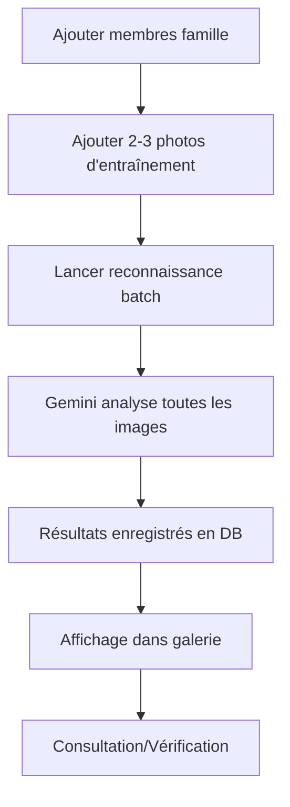

# Guide de Reconnaissance Familiale

## Vue d'ensemble

Le système de reconnaissance familiale utilise l'IA Google Gemini pour identifier automatiquement les membres de votre famille dans vos photos. Il fonctionne par apprentissage : vous fournissez des exemples de photos pour chaque personne, et l'IA apprend à les reconnaître dans de nouvelles images.

## Fonctionnalités

- ✅ **Gestion des membres de famille** : Ajoutez vos parents, frères, sœurs, oncles, etc.
- ✅ **Images d'entraînement** : Associez 2-3 photos claires de chaque personne
- ✅ **Reconnaissance automatique** : L'IA analyse vos images et identifie les personnes
- ✅ **Niveau de confiance** : Score de 0-100% pour chaque identification
- ✅ **Affichage dans la galerie** : Les personnes détectées apparaissent avec les métadonnées

## Comment utiliser

### 1. Accéder à l'administration

Depuis la page d'accueil, cliquez sur l'icône **👥 Personnes** dans le header pour accéder à `/admin/family`.

### 2. Ajouter des membres de famille

1. Cliquez sur **+ Ajouter** dans la section "Membres de la famille"
2. Remplissez le formulaire :
   - **Nom** : Prénom de la personne (obligatoire)
   - **Relation** : père, mère, frère, sœur, oncle, tante, etc.
   - **Notes** : Informations supplémentaires (optionnel)
3. Cliquez sur **Créer**

### 3. Ajouter des photos d'entraînement

1. Sélectionnez un membre de famille dans la liste de gauche
2. Cliquez sur **+ Ajouter une photo**
3. Choisissez une image de la personne dans la liste déroulante
4. Cliquez sur **Ajouter**

**Recommandations** :
- Ajoutez 2-3 photos minimum par personne
- Choisissez des photos claires où le visage est bien visible
- Variez les angles et expressions pour de meilleurs résultats
- Privilégiez des photos récentes

### 4. Lancer la reconnaissance

1. Une fois que vous avez ajouté des membres et leurs photos d'entraînement, cliquez sur **🔍 Reconnaître toutes les images** en haut à droite
2. Confirmez l'action (cela peut prendre quelques minutes selon le nombre d'images)
3. L'IA analyse toutes vos images et enregistre les personnes détectées

### 5. Voir les résultats

Les personnes détectées apparaissent automatiquement :

- **Dans la galerie** : Ouvrez une image pour voir les personnes détectées dans le panneau de droite
- **Badges colorés** : Les noms apparaissent avec un pourcentage de confiance
- **Vérification** : Une coche verte ✓ indique une détection vérifiée manuellement

## Architecture technique

### Base de données

**Tables ajoutées** :
- `family_members` : Informations sur les membres de famille
- `training_images` : Photos d'entraînement pour chaque membre
- `image_people` : Personnes détectées par l'IA dans les images

### API Endpoints

**Gestion des membres** :
- `GET /api/family/members` - Liste tous les membres
- `POST /api/family/members` - Créer un membre
- `PUT /api/family/members/:id` - Modifier un membre
- `DELETE /api/family/members/:id` - Supprimer un membre

**Images d'entraînement** :
- `GET /api/family/members/:id/training-images` - Photos d'entraînement d'un membre
- `POST /api/family/training-images` - Ajouter une photo d'entraînement
- `DELETE /api/family/training-images/:id` - Supprimer une photo

**Reconnaissance** :
- `POST /api/family/images/:imageId/recognize` - Reconnaître les personnes dans une image
- `POST /api/family/batch-recognize` - Reconnaissance par lot (toutes les images)
- `GET /api/family/images/:imageId/people` - Voir les personnes détectées

### Service Gemini

**Fonction principale** : `recognizePeople(imagePath, uploadsDir)`

1. Charge tous les membres de famille
2. Récupère jusqu'à 3 photos d'entraînement par personne
3. Construit un prompt avec :
   - Liste des membres à reconnaître
   - Images d'entraînement encodées en base64
   - Image cible à analyser
4. Appelle Gemini 2.5 Flash pour l'analyse
5. Parse la réponse JSON avec les personnes détectées
6. Retourne les résultats avec niveau de confiance

**Modèle utilisé** : `gemini-2.5-flash` (bon compromis vitesse/qualité)

## Workflow d'utilisation



## Conseils pratiques

### Optimiser la reconnaissance

- **Qualité des photos d'entraînement** : Plus elles sont claires, meilleurs sont les résultats
- **Variété** : Photos de face, de profil, souriantes, neutres
- **Contexte** : Photos similaires au type d'images à analyser (intérieur, extérieur, etc.)
- **Mise à jour** : Ajoutez de nouvelles photos si l'apparence change (coupe de cheveux, âge)

### Gérer les faux positifs

Si l'IA détecte incorrectement une personne :
1. La détection apparaît avec son niveau de confiance (%)
2. Les détections < 50% ne sont pas enregistrées automatiquement
3. Vous pouvez supprimer une détection via l'API si nécessaire

### Performance

- **Temps de traitement** : ~2-3 secondes par image
- **Coût** : Utilise l'API Gemini (tokens consommés par analyse)
- **Optimisation** : La reconnaissance batch traite les images séquentiellement

## Variables d'environnement

Le système utilise la même clé API que l'enrichissement d'images :
```
GEMINI_API_KEY=your_gemini_api_key_here
```

## Améliorations futures

- [ ] Reconnaissance en temps réel lors de l'upload
- [ ] Vérification manuelle des détections
- [ ] Filtrage par personne dans la galerie
- [ ] Bounding boxes visuels sur les photos
- [ ] Statistiques par personne (nombre de photos)

## Dépannage

### Aucune personne détectée

- Vérifiez que vous avez ajouté des photos d'entraînement
- Assurez-vous que les visages sont visibles dans les photos
- Essayez d'ajouter plus de photos d'entraînement variées

### Mauvaise identification

- Ajoutez plus d'exemples de la personne correcte
- Supprimez les photos d'entraînement floues ou peu claires
- Relancez la reconnaissance

### Erreur API

- Vérifiez que `GEMINI_API_KEY` est bien configurée
- Consultez les logs serveur pour plus de détails

## Support

Pour toute question ou problème, consultez :
- `/server/src/services/gemini.ts` - Code de reconnaissance
- `/server/src/routes/family.ts` - API endpoints
- `/client/src/pages/FamilyAdmin.tsx` - Interface admin
